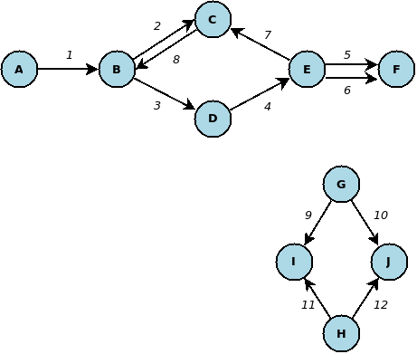

[](https://travis-ci.org/fanavarro/graphlib) [](https://codecov.io/gh/fanavarro/graphlib) [](https://opensource.org/licenses/MIT)

# graphlib
Java library for graph management.

## Graph representation
This library provides interfaces and abstract classes representing graphs, together with algorithms that can be applied to those graphs.

 Normally,  graphs are defined in such way that two nodes are connected by one edge only. Nonetheless, the graph model used by this library permits that two nodes to be linked by more than one edge, which is common in fields like ontologies.

The library relies on the Graph interface, which is parametrized with N (type of the nodes), and E (type of the edges), and declares graph methods, such as getNodes, getAdjacentNodes, or getIncomingNodes. Moreover, an AbstractGraph implementing most part of Graph interface is provided. By extending this abstract class, you only will have to implement the methods getNodes and getAdjacentNodesWithEdges. 


The idea of this library is to help developers to define custom graphs by extending the AbstractGraph class. We also provide a simple map-based implementation (SimpleGraphImpl class), which could be an example of use case where the graph backend is a java map.

## Algorithms
The library defines the following interfaces for algorithm usage:

* **Algorithm** declares the method *apply*, which receives an *AlgorithmInput* and returns an *AlgorithmOutput*.
* **AlgorithmInput** represents the input for an algorithm. The input will contain, at least, the graph in which the algorithm will be applied.
* **AlgorithmOutput** represents the output of an algorithm.

The available algorithms are described next.

### Shortest path algorithm
The shortest path algorithm (ShortestPathAlgorithm class) computes the shortest path between two nodes.

#### Input
The following parameters could be specified in ShortestPathInput class:

* **graph**: the graph in which the algorithm will be applied.
* **sourceNode**: the starting node.
* **targetNode**: the ending node.
* **maxDepth**: the maximum allowed distance.

#### Output
The algorithm returns an object with the following fields:

* **path**: the path from *sourceNode* to *targetNode* found.


### Least common node
The least common node algorithm (LeastCommonNodeAlgorithm class) computes the node or nodes that are transitively linked to a given set of nodes, minimizing the distance.

#### Input
The following parameters could be specified in LeastCommonNodeInput class:

* **graph**: the graph in which the algorithm will be applied.
* **nodes**: the nodes from which the common least node will be calculated.
* **reverse**: a boolean parameter indicating the direction in which edges will be traverse. If reverse is true, the least common ancestor will be searched by exploring the incoming nodes of the *nodes*. If reverse is false, outcoming nodes of *nodes* will be used for traversal.


#### Output
The algorithm returns a LeastCommonNodeOutput object with the following fields:

* **nodes**: the original *nodes* from which the least common node has been calculated.
* **reverse**: the *reverse* parameter specified in the input.
* **leastCommonNodes**: the node or nodes which are the least common nodes of *nodes*.


### Subtree algorithm
The subtree algorithm (SubtreeAlgorithm class) extracts a tree containing a given set of nodes.

#### Input
The following parameters could be specified in SubtreeInput class:

* **graph**: the graph in which the algorithm will be applied.
* **nodesToBeContained**: the nodes that should be present in the resulting tree.


#### Output
The algorithm returns a SubtreeOutput object with the following fields:

* **trees**: a set of trees that contain the nodes specified in *nodesToBeContained*.


## Simple example
In this section, we are going to create a simple graph called FakeGraph, used for testing, in which we could apply the available algorithms. Both nodes and edges of this graph will be text strings. Nodes are denoted by letters from "A" to "J", while edges are denoted by numbers from "1" to "12". The next figure shows the FakeGraph. As you can see, it is a cyclic, directed graph, and it contains two islands. Moreover, two nodes could be connected by more than one edge.



The first step is to create a class by extending AbstractGraph, indicating that both nodes and edges are strings. Then, we have to implement the methods *getAdjacentNodesWithEdges* and *getNodes* as follows:

* **getNodes** returns a set of all nodes in the graph. In this case, we should return the set ("A", "B", "C", "D", "E", "F", "J", "H", "I", "J").

* **getAdjacentNodesWithEdges** receives a node, and it returns a map whose keys are edges, and whose values are sets of nodes adjacent to the one passed as parameter through the corresponding edge. In this case, we are going to implement this function by simply hardcoding the desired behaviour. For example, if the node passed as parameter is "B", we should return a map indicating that the adjacent nodes are "C" through the edge "2", and "D" through the edge "3": {"2" => Set("C"); "3" => Set("D")}. In the case of the node "E", we should indicate that its adjacent nodes are "C" through the edge "7", and "F" through the edges "5" and "6": {"7" => Set("C"); "5" => Set("F"); "6" => Set("F")}.

Finally, the implementation of this graph is as follows:

```java
package es.um.dis.graphlib;

import java.util.Arrays;
import java.util.HashMap;
import java.util.HashSet;
import java.util.Map;
import java.util.Set;


/**
 * The Class FakeGraph.
 */
public class FakeGraph extends AbstractGraph<String, String> {

	/* (non-Javadoc)
	 * @see es.um.dis.graphlib.AbstractGraph#getAdjacentNodesWithEdges(java.lang.Object)
	 */
	@Override
	public Map<String, Set<String>> getAdjacentNodesWithEdges(String node) {
		Map<String, Set<String>> adjacentNodes = new HashMap<String, Set<String>>();
		if ("A".equals(node)) {
			adjacentNodes.put("1", new HashSet<String>(Arrays.asList("B")));
		} else if ("B".equals(node)) {
			adjacentNodes.put("2", new HashSet<String>(Arrays.asList("C")));
			adjacentNodes.put("3", new HashSet<String>(Arrays.asList("D")));
		} else if ("C".equals(node)) {
			adjacentNodes.put("8", new HashSet<String>(Arrays.asList("B")));
		} else if ("D".equals(node)) {
			adjacentNodes.put("4", new HashSet<String>(Arrays.asList("E")));
		} else if ("E".equals(node)) {
			adjacentNodes.put("5", new HashSet<String>(Arrays.asList("F")));
			adjacentNodes.put("6", new HashSet<String>(Arrays.asList("F")));
			adjacentNodes.put("7", new HashSet<String>(Arrays.asList("C")));
		} else if ("F".equals(node)) {
			// no edges
		} else if ("G".equals(node)){
			adjacentNodes.put("9", new HashSet<String>(Arrays.asList("I")));
			adjacentNodes.put("10", new HashSet<String>(Arrays.asList("J")));
		} else if ("H".equals(node)){
			adjacentNodes.put("11", new HashSet<String>(Arrays.asList("I")));
			adjacentNodes.put("12", new HashSet<String>(Arrays.asList("J")));
		} else if ("I".equals(node)) {
			// no edges
		} else if ("J".equals(node)) {
			// no edges
		}
		return adjacentNodes;
	}

	/* (non-Javadoc)
	 * @see es.um.dis.graphlib.AbstractGraph#getNodes()
	 */
	@Override
	public Set<String> getNodes() {
		return new HashSet<String>(Arrays.asList("A", "B", "C", "D", "E", "F", "G", "H", "I", "J"));
	}
}
```

At this point, we can apply algorithms to the graph. As example, below is showed a test case for the least common node algorithm, which computes the least common node of "A" and "C" in the FakeGraph, which results in node "B":

```java
@Test
public void leastCommonNodeTest1() {
	/* Create the graph */
	FakeGraph graph = new FakeGraph();

	/* Create the algorithm to apply */
	LeastCommonNodeAlgorithm<String, String> algorithm = new LeastCommonNodeAlgorithm<String, String>();

	/* Create the input for the algorithm */
	LeastCommonNodeInput<String, String> input = new LeastCommonNodeInput<String, String>();
	input.setGraph(graph);
	input.setNodes(new HashSet<String>(Arrays.asList("A", "C")));

	/* Apply the algorithm */
	LeastCommonNodeOutput<String, String> output = (LeastCommonNodeOutput<String, String>) graph
			.applyAlgorithm(algorithm, input);

	/* Check output */
	assertNotNull(output);
	assertNotNull(output.getLeastCommonNodes());
	assertEquals(1, output.getLeastCommonNodes().size());
	assertTrue(output.getLeastCommonNodes().contains("B"));
}
```

For more examples, please check the [test cases](./src/test/java/es/um/dis/graphlib/algorithms) provided for each algorithm.
